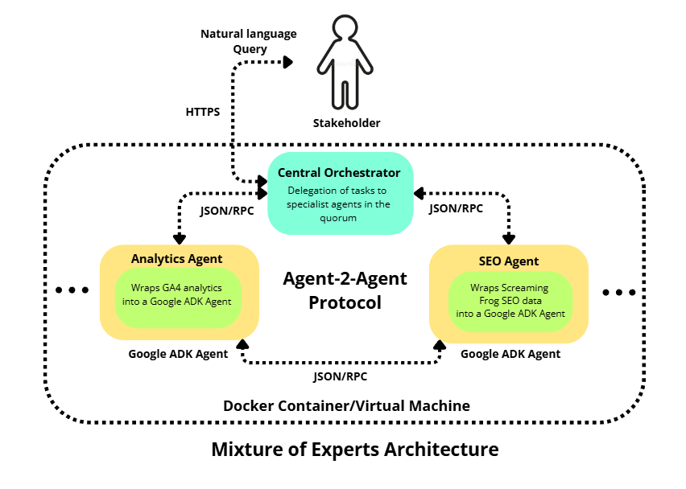

# Spike AI Analytics Platform - Microservice Architecture

## 1. Executive Summary

This project implements a production-ready **Multi-Agent System** for analyzing Web Analytics (GA4) and Technical SEO data. 

Using a **Clean Microservices Architecture**, we have a robust system with independent expert agents that operate separately and are orchestrated by a central intelligent router. This design ensures modularity, scalability, and precise fault isolation—allowing specialized agents to operate independently.

## 2. Architecture: Agents as Microservices



The system is composed of three distinct microservices, communicating over HTTP with clean JSON APIs.

### 2.1 The Orchestrator (Port 8080)
*   **Role**: The "Brain" and public face of the system.
*   **Responsibility**: Receiving user queries via a single `POST /query` endpoint.
*   **Logic**: Routes requests to appropriate experts based on query intent.
*   **Features**: Health checks, intelligent routing, error handling.

### 2.2 The Analytics Agent (Port 8001)
*   **Role**: A specialized agent for Google Analytics 4.
*   **Tools**: GA4 Data API integration (`google.analytics.data`).
*   **Security**: Runs in its own process for isolation and fault tolerance.
*   **Features**: Query GA4, get metrics/dimensions, process analytics data.

### 2.3 The SEO Agent (Port 8002)
*   **Role**: A specialized agent for Technical SEO audit data.
*   **Tools**: Pandas-based data filtering and analysis.
*   **Features**: Query SEO crawl data, filter by criteria, identify issues.

## 3. Technology Stack

Simple, clean, and production-ready stack using standard Python libraries.

| Component | Technology | Purpose |
| :--- | :--- | :--- |
| **Web Framework** | **FastAPI + Uvicorn** | High-performance async Python API framework |
| **HTTP Client** | **httpx** | Async HTTP client for service-to-service communication |
| **LLM Interface** | **OpenAI Python Client** | Unified interface to LLM APIs (OpenAI-compatible) |
| **Data Processing** | **Pandas** | Data manipulation and analysis |
| **Analytics API** | **google-analytics-data** | Official Google Analytics 4 Data API |
| **Configuration** | **python-dotenv** | Environment-based configuration |
| **Server** | **Uvicorn** | ASGI server for production deployment |

## 4. Why Microservices? (Superiority over Monolith)

In a traditional Monolithic Agent approach, all tools (GA4, SEO, Database, CRM) are crammed into a single agent context.

**The Monolith Problem:**
1.  **Context Pollution**: The LLM gets confused by having too many tools in its prompt description.
2.  **Single Point of Failure**: A bug in the SEO tool crashes the web server for everyone.
3.  **Scaling Constraints**: You cannot scale the Analytics agent independently if it receives 90% of the traffic.

**The Microservice Solution (Our Approach):**
1.  **Cognitive Isolation**: The Analytics Agent *only* knows about GA4. It is an expert. The Orchestrator *only* knows who to call. This reduces hallucinations.
2.  **Independent Scaling**: We can deploy 10 replicas of the Analytics container and 1 of the SEO container based on load.
3.  **Fault Tolerance**: If the SEO service is down, the Orchestrator can still serve Analytics queries gracefully.
4.  **Team Velocity**: One team can work on the SEO logic (Port 8002) while another refactors the Orchestrator (Port 8080) without effectively stepping on each other's toes.

## 5. Project Structure

Clean, organized codebase with clear separation of concerns.

```
services/
├── orchestrator/          # Request Router (Port 8080)
│   ├── main.py           # FastAPI app & endpoints
│   └── agent.py          # Routing logic
├── analytics_agent/       # GA4 Expert (Port 8001)
│   ├── main.py           # FastAPI app & endpoints
│   ├── agent.py          # Analytics logic
│   └── tools.py          # GA4 API integration
└── seo_agent/            # SEO Expert (Port 8002)
    ├── main.py           # FastAPI app & endpoints
    ├── agent.py          # SEO logic
    └── tools.py          # Data filtering utilities

shared/
└── llm.py                # LLM client configuration

requirements.txt          # Python dependencies
.env.template            # Configuration template
.gitignore               # Git ignore rules
deploy.ps1               # Windows deployment
start.sh                 # Linux/Mac startup
SETUP.md                 # Setup instructions
```

## 6. How to Run

### Prerequisites
*   Python 3.10+
*   pip or venv installed

### Quick Start

**Windows (PowerShell):**
```powershell
.\deploy.ps1
```

**Linux/Mac (Bash):**
```bash
bash start.sh
```

**Manual Start (Any OS):**
Terminal 1 - Analytics Agent (Port 8001):
```bash
python -m uvicorn services.analytics_agent.main:app --host 0.0.0.0 --port 8001
```

Terminal 2 - SEO Agent (Port 8002):
```bash
python -m uvicorn services.seo_agent.main:app --host 0.0.0.0 --port 8002
```

Terminal 3 - Orchestrator (Port 8080):
```bash
python -m uvicorn services.orchestrator.main:app --host 0.0.0.0 --port 8080
```

### Services Running
Once all services start, you'll have:
*   **Orchestrator**: `http://localhost:8080` (Public API - use this)
*   **Analytics Agent**: `http://localhost:8001` (Internal service)
*   **SEO Agent**: `http://localhost:8002` (Internal service)

## 7. API Endpoints - Health Checks

### Health Check - Orchestrator
**Method:** GET  
**URL:** `http://localhost:8080/health`

**Response:**
```json
{
  "status": "healthy",
  "service": "orchestrator"
}
```

### Health Check - Analytics Agent
**Method:** GET  
**URL:** `http://localhost:8001/health`

**Response:**
```json
{
  "status": "healthy",
  "service": "analytics_agent"
}
```

### Health Check - SEO Agent
**Method:** GET  
**URL:** `http://localhost:8002/health`

**Response:**
```json
{
  "status": "healthy",
  "service": "seo_agent"
}
```

## 8. Postman API Examples

### 8.1 Orchestrator Query (Main Endpoint)

**Method:** POST  
**URL:** `http://localhost:8080/query`  
**Headers:** `Content-Type: application/json`

**Body - Analytics Query:**
```json
{
  "query": "How many active users did we have last week?",
  "propertyId": "123456789"
}
```

**Body - SEO Query:**
```json
{
  "query": "Find pages with missing titles"
}
```

**Body - Combined Query:**
```json
{
  "query": "What are my top pages by views and their title tags?",
  "propertyId": "123456789"
}
```

**Expected Response:**
```json
{
  "status": "success",
  "query": "How many active users did we have last week?",
  "property_id": "123456789"
}
```

### 8.2 Analytics Agent Direct Query

**Method:** POST  
**URL:** `http://localhost:8001/query`  
**Headers:** `Content-Type: application/json`

**Body - Get Page Views:**
```json
{
  "query": "Give me daily page views for the last 14 days",
  "propertyId": "123456789"
}
```

**Body - Get Active Users:**
```json
{
  "query": "What are active users by country for the last 30 days?",
  "propertyId": "123456789"
}
```

**Body - Get Sessions:**
```json
{
  "query": "Show me session data by device category",
  "propertyId": "123456789"
}
```

### 8.3 SEO Agent Direct Query

**Method:** POST  
**URL:** `http://localhost:8002/query`  
**Headers:** `Content-Type: application/json`

**Body - SEO Analysis:**
```json
{
  "query": "Find all pages with HTTP status codes that are not 200"
}
```

**Body - Missing Meta Tags:**
```json
{
  "query": "Show me pages with missing meta descriptions"
}
```

**Body - HTTPS Check:**
```json
{
  "query": "List pages that are not using HTTPS"
}
```

## 9. Postman Collection (Import Ready)

Save this as `postman_collection.json` and import into Postman:

```json
{
  "info": {
    "name": "Spike AI Analytics API",
    "description": "Multi-agent analytics and SEO system",
    "schema": "https://schema.getpostman.com/json/collection/v2.1.0/collection.json"
  },
  "item": [
    {
      "name": "Health Checks",
      "item": [
        {
          "name": "Orchestrator Health",
          "request": {
            "method": "GET",
            "header": [],
            "url": "http://localhost:8080/health"
          }
        },
        {
          "name": "Analytics Agent Health",
          "request": {
            "method": "GET",
            "header": [],
            "url": "http://localhost:8001/health"
          }
        },
        {
          "name": "SEO Agent Health",
          "request": {
            "method": "GET",
            "header": [],
            "url": "http://localhost:8002/health"
          }
        }
      ]
    },
    {
      "name": "Orchestrator Queries",
      "item": [
        {
          "name": "Analytics Query",
          "request": {
            "method": "POST",
            "header": [
              {
                "key": "Content-Type",
                "value": "application/json"
              }
            ],
            "body": {
              "mode": "raw",
              "raw": "{\n  \"query\": \"How many active users did we have last week?\",\n  \"propertyId\": \"123456789\"\n}"
            },
            "url": "http://localhost:8080/query"
          }
        },
        {
          "name": "SEO Query",
          "request": {
            "method": "POST",
            "header": [
              {
                "key": "Content-Type",
                "value": "application/json"
              }
            ],
            "body": {
              "mode": "raw",
              "raw": "{\n  \"query\": \"Find pages with missing titles\"\n}"
            },
            "url": "http://localhost:8080/query"
          }
        }
      ]
    },
    {
      "name": "Analytics Agent",
      "item": [
        {
          "name": "Page Views Query",
          "request": {
            "method": "POST",
            "header": [
              {
                "key": "Content-Type",
                "value": "application/json"
              }
            ],
            "body": {
              "mode": "raw",
              "raw": "{\n  \"query\": \"Give me daily page views for the last 14 days\",\n  \"propertyId\": \"123456789\"\n}"
            },
            "url": "http://localhost:8001/query"
          }
        },
        {
          "name": "Active Users Query",
          "request": {
            "method": "POST",
            "header": [
              {
                "key": "Content-Type",
                "value": "application/json"
              }
            ],
            "body": {
              "mode": "raw",
              "raw": "{\n  \"query\": \"What are active users by country for the last 30 days?\",\n  \"propertyId\": \"123456789\"\n}"
            },
            "url": "http://localhost:8001/query"
          }
        }
      ]
    },
    {
      "name": "SEO Agent",
      "item": [
        {
          "name": "Status Code Check",
          "request": {
            "method": "POST",
            "header": [
              {
                "key": "Content-Type",
                "value": "application/json"
              }
            ],
            "body": {
              "mode": "raw",
              "raw": "{\n  \"query\": \"Find all pages with HTTP status codes that are not 200\"\n}"
            },
            "url": "http://localhost:8002/query"
          }
        },
        {
          "name": "HTTPS Check",
          "request": {
            "method": "POST",
            "header": [
              {
                "key": "Content-Type",
                "value": "application/json"
              }
            ],
            "body": {
              "mode": "raw",
              "raw": "{\n  \"query\": \"List pages that are not using HTTPS\"\n}"
            },
            "url": "http://localhost:8002/query"
          }
        }
      ]
    }
  ]
}
```

## 10. cURL Examples

**Health Check:**
```bash
curl http://localhost:8080/health
```

**Analytics Query:**
```bash
curl -X POST "http://localhost:8080/query" \
     -H "Content-Type: application/json" \
     -d '{
           "query": "How many active users did we have last week?",
           "propertyId": "123456789"
         }'
```

**SEO Query:**
```bash
curl -X POST "http://localhost:8080/query" \
     -H "Content-Type: application/json" \
     -d '{
           "query": "Find pages with missing titles"
         }'
```

**Direct Analytics Agent Query:**
```bash
curl -X POST "http://localhost:8001/query" \
     -H "Content-Type: application/json" \
     -d '{
           "query": "Give me page views for last 7 days",
           "propertyId": "123456789"
         }'
```

**Direct SEO Agent Query:**
```bash
curl -X POST "http://localhost:8002/query" \
     -H "Content-Type: application/json" \
     -d '{
           "query": "Find pages with HTTP errors"
         }'
```
